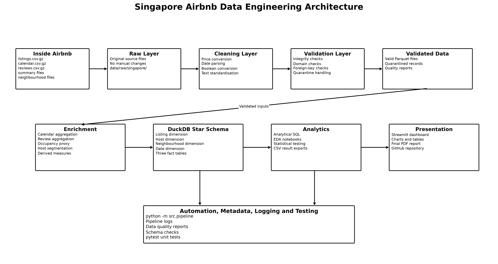
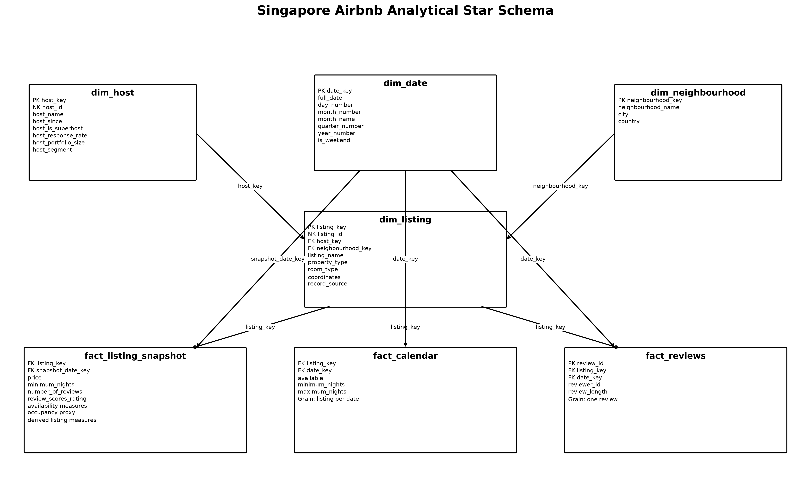

# Singapore Airbnb Data Engineering and Market Intelligence Pipeline

A reproducible data engineering and analytical project built for the Expernetic Data Engineer Intern technical assessment.

The project processes the Singapore Inside Airbnb dataset dated **29 June 2026**. It covers data profiling, cleaning, validation, enrichment, dimensional modelling, SQL analysis, exploratory data analysis, statistical testing, and an interactive Streamlit dashboard.

## Live Dashboard

The deployed Streamlit dashboard is available here:

[Open the Singapore Airbnb Market Intelligence Dashboard](https://nipuni-airbnb-dashboard.streamlit.app/)

GitHub repository:

[expernetic-airbnb-data-engineering](https://github.com/nsiriwardhana/expernetic-airbnb-data-engineering)

## Project Objectives

The project was designed to:

- preserve the original source data in a raw layer
- standardise prices, dates, Boolean fields, percentages, and text values
- validate critical integrity and domain rules
- quarantine invalid records without silent data loss
- combine detailed and summary listings into a complete listing master
- derive listing, host, review, calendar, and neighbourhood measures
- build an analytical star schema in DuckDB
- produce reusable SQL outputs
- conduct exploratory and statistical analysis
- provide an interactive dashboard for business users

## Selected Scope

This submission focuses on one city, Singapore, to prioritise engineering quality, reproducibility, testing, and analytical depth.

Completed areas include:

- dataset familiarisation and profiling
- cleaning and standardisation
- validation and quarantine handling
- enrichment and aggregation
- Parquet-based storage
- DuckDB dimensional modelling
- analytical SQL queries
- exploratory data analysis
- statistical hypothesis testing
- Streamlit dashboard
- automated tests
- pipeline logging and orchestration
- architecture and data model documentation
- Streamlit Community Cloud deployment
- AI usage disclosure

The following optional areas were not prioritised:

- multi-city processing
- machine-learning price prediction
- NLP and review sentiment analysis
- RAG or LLM applications
- Airflow or Prefect orchestration
- full change data capture
- MLOps deployment

## Dataset

Source: [Inside Airbnb](https://insideairbnb.com/get-the-data/)

City: Singapore  
Snapshot date: 29 June 2026

Expected files:

```text
data/raw/singapore/
├── calendar.csv.gz
├── listings.csv
├── listings.csv.gz
├── neighbourhoods.csv
├── neighbourhoods.geojson
├── reviews.csv
└── reviews.csv.gz
```

Raw files are excluded from GitHub because of their size. Download the Singapore files from Inside Airbnb and place them in the directory shown above.

## Data Architecture

The project follows a layered data engineering architecture from raw source files through cleaning, validation, enrichment, analytical modelling, and presentation.



## Analytical Data Model

The DuckDB analytical layer uses listing, host, neighbourhood, and date dimensions with three fact tables.



Main tables:

| Table | Grain |
|---|---|
| `dim_listing` | One row per listing |
| `dim_host` | One row per host |
| `dim_neighbourhood` | One row per neighbourhood |
| `dim_date` | One row per date |
| `fact_listing_snapshot` | One row per listing snapshot |
| `fact_calendar` | One row per listing per calendar date |
| `fact_reviews` | One row per detailed review |

Latest model counts:

| Table | Rows |
|---|---:|
| `dim_host` | 762 |
| `dim_neighbourhood` | 42 |
| `dim_listing` | 3,247 |
| `dim_date` | 4,836 |
| `fact_listing_snapshot` | 3,247 |
| `fact_calendar` | 1,185,155 |
| `fact_reviews` | 41,265 |

All implemented duplicate-key and orphan-key schema checks passed.

## Dashboard Deployment Data Layer

The main analytical pipeline processes the complete Singapore dataset, including:

- 3,247 listings
- 1,185,155 calendar observations
- 41,265 detailed reviews

The deployed Streamlit application uses a compact serving database generated from the complete analytical DuckDB model.

No listings are sampled or removed. The serving database contains all 3,247 listing-level records. Calendar and review records are aggregated to monthly level because the dashboard displays monthly market-wide trends and does not require every row-level record at runtime.

The serving database validation produced:

| Measure | Value |
|---|---:|
| Source listing rows | 3,247 |
| Dashboard listing rows | 3,247 |
| Source calendar rows used | 1,185,155 |
| Monthly availability rows created | 14 |
| Source review rows used | 41,265 |
| Monthly review rows created | 180 |
| Serving database size | 1.26 MB |

The full analytical database remains reproducible with:

```bash
python -m src.pipeline
```

The dashboard serving database is generated with:

```bash
python -m src.create_dashboard_database
```

This separation reduces deployment size and query cost while preserving the complete population used in dashboard calculations.

## Repository Structure

```text
expernetic-airbnb-data-engineering/
├── config/
│   └── config.yaml
├── dashboard/
│   ├── app.py
│   └── requirements.txt
├── data/
│   ├── raw/
│   ├── processed/
│   ├── validated/
│   ├── quarantine/
│   └── enriched/
├── docs/
│   ├── architecture.png
│   ├── star_schema.png
│   ├── assumptions.md
│   ├── decision_log.md
│   ├── data_dictionary.md
│   └── data_lineage.md
├── notebooks/
│   ├── 01_dataset_understanding.ipynb
│   ├── 02_eda.ipynb
│   └── 03_statistical_analysis.ipynb
├── outputs/
│   ├── charts/
│   ├── database/
│   ├── data_quality/
│   ├── logs/
│   └── tables/
├── report/
├── sql/
│   └── analysis_queries.sql
├── src/
│   ├── clean_data.py
│   ├── validate_data.py
│   ├── enrich_data.py
│   ├── run_cleaning.py
│   ├── run_validation.py
│   ├── run_enrichment.py
│   ├── build_database.py
│   ├── run_sql_analysis.py
│   ├── pipeline.py
│   ├── create_diagrams.py
│   └── create_dashboard_database.py
├── tests/
│   ├── test_clean_data.py
│   ├── test_validation.py
│   └── test_enrichment.py
├── .gitignore
├── pytest.ini
├── requirements.txt
└── README.md
```

## Technology Stack

- Python
- pandas
- NumPy
- PyArrow
- DuckDB
- SQL
- Jupyter Notebook
- SciPy
- statsmodels
- matplotlib
- Plotly
- Streamlit
- pytest
- Git and GitHub

## Setup Instructions

### 1. Clone the repository

```bash
git clone https://github.com/nsiriwardhana/expernetic-airbnb-data-engineering.git
cd expernetic-airbnb-data-engineering
```

### 2. Create a virtual environment

Windows:

```bash
python -m venv venv
venv\Scripts\activate
```

macOS or Linux:

```bash
python -m venv venv
source venv/bin/activate
```

### 3. Install dependencies

```bash
python -m pip install --upgrade pip
python -m pip install -r requirements.txt
```

### 4. Add the source data

Download the Singapore files from Inside Airbnb and place them in:

```text
data/raw/singapore/
```

## Run the Complete Pipeline

Stop the Streamlit dashboard before rebuilding the DuckDB database.

```bash
python -m src.pipeline
```

The pipeline performs:

1. cleaning and standardisation
2. rule-based validation and quarantine
3. enrichment and aggregation
4. DuckDB star-schema construction
5. analytical SQL execution

Pipeline logs are saved under:

```text
outputs/logs/
```

To run the engineering stages without analytical SQL:

```bash
python -m src.pipeline --skip-sql
```

## Run Individual Pipeline Stages

```bash
python -m src.run_cleaning
python -m src.run_validation
python -m src.run_enrichment
python -m src.build_database
python -m src.run_sql_analysis
```

## Run Automated Tests

```bash
python -m pytest
```

## Run the Interactive Dashboard

The deployed dashboard is available at:

[https://nipuni-airbnb-dashboard.streamlit.app/](https://nipuni-airbnb-dashboard.streamlit.app/)

The repository includes the compact dashboard serving database, so the dashboard can also be started locally after installing the project dependencies:

```bash
python -m streamlit run dashboard/app.py
```

To recreate the dashboard serving database from the complete analytical model:

```bash
python -m src.build_database
python -m src.create_dashboard_database
python -m streamlit run dashboard/app.py
```

The dashboard includes:

- market KPIs
- room-type pricing
- neighbourhood pricing
- host portfolio analysis
- superhost comparison
- availability trends
- review trends
- geographic listing distribution
- statistical findings
- data-quality and source-coverage views

## Jupyter Notebooks

### `01_dataset_understanding.ipynb`

Covers source schemas, missing values, duplicates, keys, relationships, and source limitations.

### `02_eda.ipynb`

Covers price distributions, room types, neighbourhoods, host concentration, occupancy proxy, reviews, and geographic density.

### `03_statistical_analysis.ipynb`

Tests:

1. entire-home versus private-room prices
2. superhost versus non-superhost ratings
3. price differences by review-volume group

The analysis reports medians, Mann-Whitney U statistics, p-values, Holm-adjusted p-values, effect sizes, bootstrap confidence intervals, and business interpretations.

## Data Quality Approach

Critical failures are quarantined. Examples include:

- missing or duplicate primary keys
- invalid coordinates
- negative prices
- negative review counts
- invalid availability ranges
- orphan listing references
- duplicate listing-date calendar keys

Missing optional analytical values are retained as explicit nulls and reported as completeness warnings.

## Important Assumptions

- Calendar unavailability is treated only as an estimated occupancy proxy.
- An unavailable date may indicate a booking, host block, maintenance, personal use, or another restriction.
- The calendar dataset does not include daily prices.
- Weekend-versus-weekday pricing and daily revenue estimation are therefore not performed.
- Review activity is an imperfect demand proxy.
- Statistical associations are not interpreted as causal effects.
- Price charts may be limited to the 99th percentile for readability.

Further assumptions are documented in `docs/assumptions.md`.

## Engineering Decisions

Key decisions include:

- selecting one city to prioritise depth and quality
- retaining raw data unchanged
- combining detailed and summary listings
- storing cleaned outputs in Parquet
- separating critical failures from completeness warnings
- aggregating calendar and review data before listing-level joins
- implementing a dimensional model in DuckDB
- using non-parametric statistical tests
- building a compact dashboard serving layer
- deploying the dashboard with Streamlit Community Cloud

The full decision log is available in `docs/decision_log.md`.

## Outputs

Main generated outputs include:

```text
data/processed/
data/validated/
data/quarantine/
data/enriched/
outputs/database/airbnb_singapore.duckdb
outputs/database/airbnb_dashboard_serving.duckdb
outputs/data_quality/
outputs/tables/sql_analysis/
outputs/tables/eda/
outputs/tables/statistics/
outputs/charts/eda/
outputs/charts/statistics/
outputs/logs/
```

## Limitations

- The dataset is a scraped market snapshot rather than a complete transaction history.
- Calendar unavailability does not confirm a booking.
- The calendar source has no daily price field.
- Some listings contain missing analytical attributes.
- Reviews do not represent every completed stay.
- A one-city design does not demonstrate cross-city schema harmonisation.
- Statistical tests describe associations and do not establish causation.
- Monthly deployment tables are intended for dashboard trends rather than row-level calendar or review analysis.

## Future Improvements

- configuration-driven multi-city ingestion
- incremental processing
- change data capture
- cloud object storage and managed analytical services
- dbt models and tests
- workflow orchestration
- Docker packaging
- automated refresh of the deployed serving database
- price prediction
- review sentiment and topic analysis
- monitoring, alerting, and SLA reporting

## AI Usage Disclosure

AI tools were used for planning, code review, validation-rule design, documentation support, statistical-method review, and language improvement.

All AI-assisted code and text were executed, reviewed, modified, and validated against the actual dataset.

The full disclosure is documented in `docs/ai_usage_disclosure.md`.

## Reproducibility

A reviewer should be able to reproduce the main outputs by:

1. cloning the repository
2. creating the Python environment
3. installing `requirements.txt`
4. downloading the Singapore source files
5. placing them under `data/raw/singapore/`
6. running `python -m pytest`
7. running `python -m src.pipeline`
8. running the EDA and statistical notebooks
9. running `python -m src.create_dashboard_database`
10. launching `python -m streamlit run dashboard/app.py`